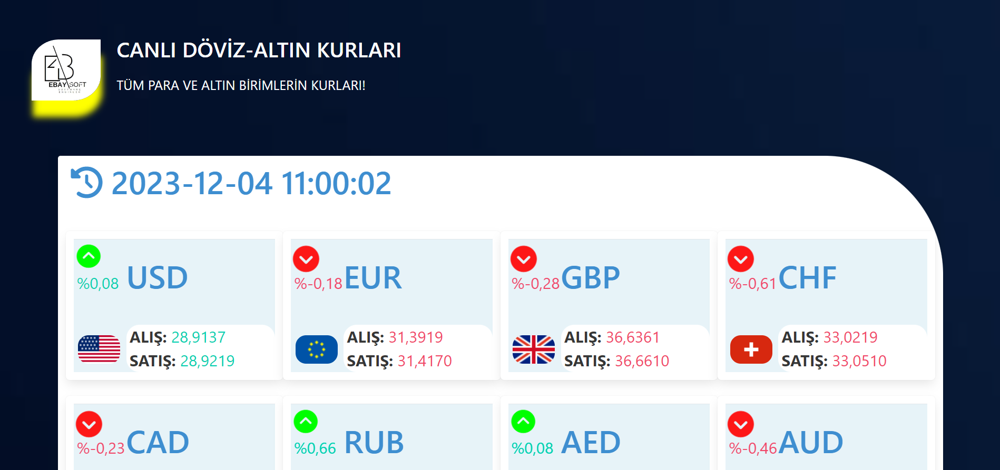

# ***NODEJS DÖVİZ KUR FİYATLARI WEBSİTE***

  

<b>-> Bu web site döviz kurlarının güncel kur fiyatlarını sunar bize. </b>
  

-> Bu proje NODE-JS ile yapılmıştır.. 
-> API kaynaklarından güncel veriler çekilerek kullanıcıya sunulur! 
-> Web scrapper yapılmıştır!
 

 
 

    <h6>Ana Sayfa:</h6> 
      

